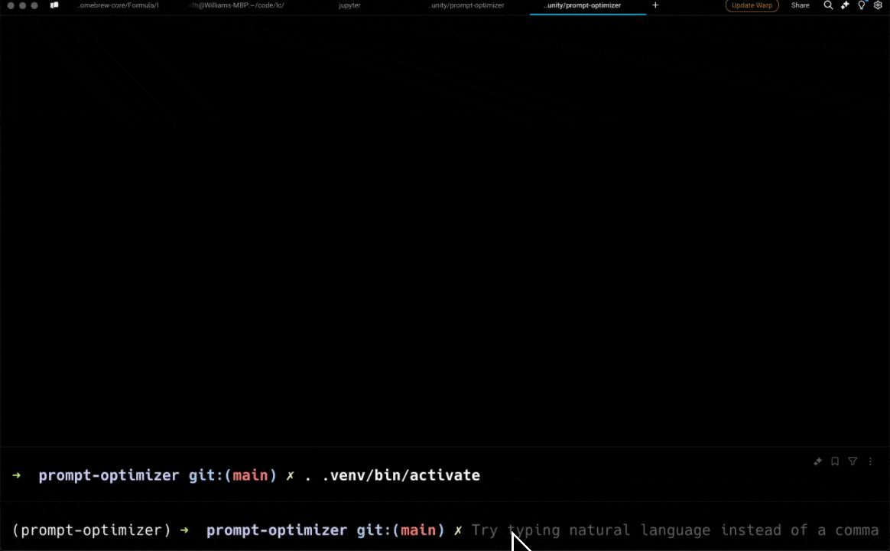

# promptimizer

Prompt optimization trainer.

Example:

```shell
uv venv
source .venv/bin/activate
uv pip install -e .
python main.py tweet
```

Script:

```shell
usage: main.py [-h] [--batch-size BATCH_SIZE] [--train-size TRAIN_SIZE] [--epochs EPOCHS]
               {scone,tweet,metaprompt,simpleqa}

Optimize prompts for different tasks.

positional arguments:
  {scone,tweet,metaprompt,simpleqa}
                        Task to optimize

options:
  -h, --help            show this help message and exit
  --batch-size BATCH_SIZE
                        Batch size for optimization
  --train-size TRAIN_SIZE
                        Training size for optimization
  --epochs EPOCHS       Number of epochs for optimization
```

Currently has ~ 4 tasks:

- tweet: write tweets
- simpleqa: really hard Q&A
- scone: NLI
- metaprompt: optimize the metaprompt itself over the above 3 tasks

